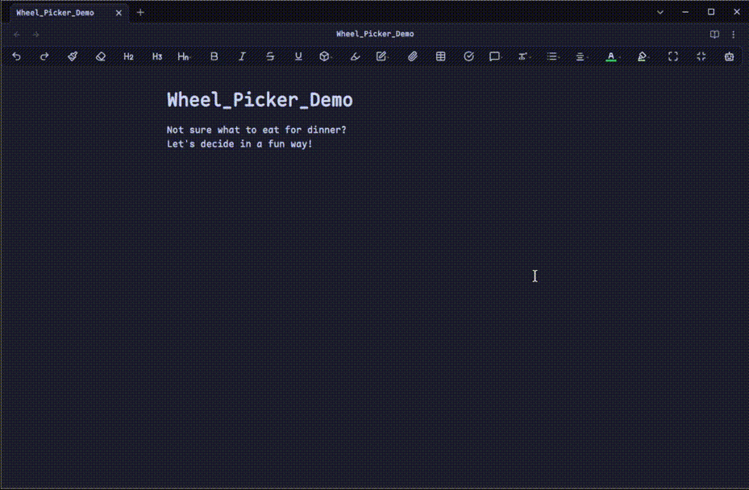
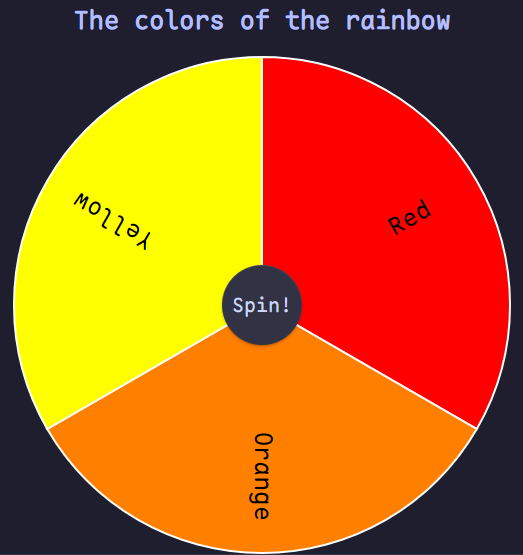

# Wheel Picker -- Obsidian Plugin

## What is it?

Wheel Picker is an obsidian plugin to help visualize and select from lists in a fun way.

## How do I use it?

### Live Demo



### Sample Wheel Picker codeblock

````
```wp
-What should I eat for dinner?-
Sushi
Burger
Pizza
Tacos
```
````

### How do I create my own wheel?

1) Empty Codeblock

To create a codeblock, create a triplet of the ` character. On the next line, do the same.
You should now see an empty codeblock.

````
```
```
````

2) Connect with Wheel Picker

At the end of the first triplet, add `wp`.
This lets the plugin know that it's is going to read this codeblock.

````
```wp
```
````

3) Add a Title

At the end of the first row, hit enter to make a new line.
Write a double hyphen (aka minus sign or dash) `--`.
Within this double hyphen create a title.

````
```wp
-The colors of the rainbow-
```
````

4) Add some data

This is where you will be adding actual data to the wheel itself.
Every row will indicate a new slice on the wheel.
Let's add 3 new rows for the first three colors of the rainbow.

````
```wp
-The colors of the rainbow-
Red
Orange
Yellow
```
````

5) Spin the wheel

The wheel now has all the data need to be displayed.
It should look like this:



Now to spin it, tap/click the central button saying "Spin!"
The wheel will now spin, and select an element at random from the wheel.


# FAQ

- My Wheel isn't displaying anything!

> While a wheel may not have a title...
> Every wheel must have at least 2 rows of data.
> Make sure that you are putting each row of data onto its own line within the codeblock.

- My wheel doesn't look good! Can I change X?

> Absolutely!
> In the settings of the plugin, you should be able to customize the colors, sizes, and more of just about any part of this plugin.

# How to Install

The suggested way to install this plugin is via the list of obsidian community plugins

1) Make sure that you have `Third-party plugins` enabled and `Safe Mode` is turned off.
2) Browse the community plugins for `Wheel Picker`.
3) Install the plugin, close the window, then activate the freshly installed `Wheel Picker` plugin.

# Tips/Donations

This plugin is made by me, for free to anyone and everyone.
Any donations and tips are graciously accepted.

> [!Note]
> That the following link takes you to my personal website.

[Link to my website's tip page](https://personal-website-ezra-dvlpr.vercel.app/tips)

Thank you very much if you donate!

# Suggestions

If you have any suggestions or encounter any bugs/have bug-fixes please feel free to email me at:

> EZRA-DVLPR@protonmail.com
